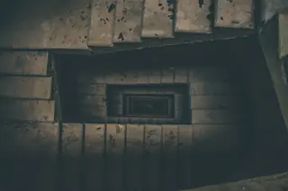

# 🖼 Wallpapers

**Total Wallpapers:** **43**

---

<table>
<tr>

<td align="center" valign="top">

</td>

<td align="center" valign="top">

</td>

<td align="center" valign="top">

</td>

</tr>
<tr>

<td align="center" valign="top">

</td>

<td align="center" valign="top">

</td>

<td align="center" valign="top">

</td>

</tr>
<tr>

<td align="center" valign="top">

</td>

<td align="center" valign="top">

</td>

<td align="center" valign="top">

</td>

</tr>
<tr>

<td align="center" valign="top">

</td>

<td align="center" valign="top">

</td>

<td align="center" valign="top">

</td>

</tr>
<tr>

<td align="center" valign="top">

</td>

<td align="center" valign="top">

</td>

<td align="center" valign="top">

</td>

</tr>
<tr>

<td align="center" valign="top">

</td>

<td align="center" valign="top">

</td>

<td align="center" valign="top">

</td>

</tr>
<tr>

<td align="center" valign="top">

</td>

<td align="center" valign="top">

</td>

<td align="center" valign="top">

</td>

</tr>
<tr>

<td align="center" valign="top">

</td>

<td align="center" valign="top">

</td>

<td align="center" valign="top">

</td>

</tr>
<tr>

<td align="center" valign="top">

</td>

<td align="center" valign="top">

</td>

<td align="center" valign="top">

</td>

</tr>
<tr>

<td align="center" valign="top">

</td>

<td align="center" valign="top">

</td>

<td align="center" valign="top">

</td>

</tr>
<tr>

<td align="center" valign="top">

</td>

<td align="center" valign="top">

</td>

<td align="center" valign="top">

</td>

</tr>
<tr>

<td align="center" valign="top">

</td>

<td align="center" valign="top">

</td>

<td align="center" valign="top">

</td>

</tr>
<tr>

<td align="center" valign="top">

</td>

<td align="center" valign="top">

</td>

<td align="center" valign="top">

</td>

</tr>
<tr>

<td align="center" valign="top">

</td>

<td align="center" valign="top">

</td>

<td align="center" valign="top">

</td>

</tr>
<tr>

<td align="center" valign="top">

</td>

<td></td>
<td></td>
</tr>
</table>