# 🖼 Wallpapers

**Total Wallpapers:** **44**

---

<table>
<tr>

<td align="center" width="33.33%">
<a href="(Berserk)Eclipse.png">
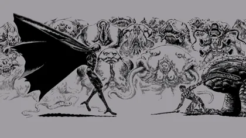
</a>
 
(Berserk)Eclipse
</td>

<td align="center" width="33.33%">
<a href="(Berserk)Griffith&YoungCasca.png">
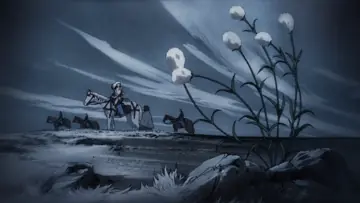
</a>
 
(Berserk)Griffith&amp;YoungCasca
</td>

<td align="center" width="33.33%">

 
(Berserk)GriffithBehelit
</td>

</tr>
<tr>

<td align="center" width="33.33%">
<a href="(Berserk)GriffithsDream.png">
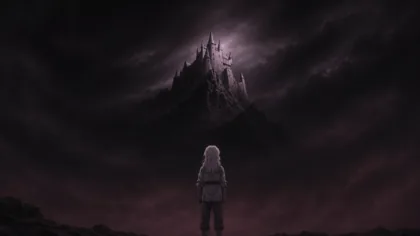
</a>
 
(Berserk)GriffithsDream
</td>

<td align="center" width="33.33%">

 
(Berserk)Guts&amp;Griffith
</td>

<td align="center" width="33.33%">

 
(Berserk)GutsBeam
</td>

</tr>
<tr>

<td align="center" width="33.33%">

 
(Berserk)GutsHurt
</td>

<td align="center" width="33.33%">
<a href="(DC)BatmanUpsideDown.png">
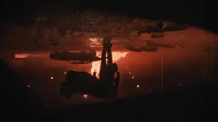
</a>
 
(DC)BatmanUpsideDown
</td>

<td align="center" width="33.33%">

 
(DC)Beginings
</td>

</tr>
<tr>

<td align="center" width="33.33%">

 
(DC)SupermansHand
</td>

<td align="center" width="33.33%">

 
(Dune)Arrakis
</td>

<td align="center" width="33.33%">

 
(Dune)DuneAsteroid
</td>

</tr>
<tr>

<td align="center" width="33.33%">

 
(Dune)DuneHarkonenShip
</td>

<td align="center" width="33.33%">

 
(Dune)DuneMountain
</td>

<td align="center" width="33.33%">

 
(Dune)DuneOrbitalEclypse
</td>

</tr>
<tr>

<td align="center" width="33.33%">

 
(Dune)DuneSpaceship
</td>

<td align="center" width="33.33%">

 
(Dune)DuneSpaceships
</td>

<td align="center" width="33.33%">
<a href="(Dune)HarkonenArena.png">
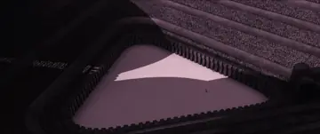
</a>
 
(Dune)HarkonenArena
</td>

</tr>
<tr>

<td align="center" width="33.33%">
<a href="(Dune)HarkonenArena16_9.png">
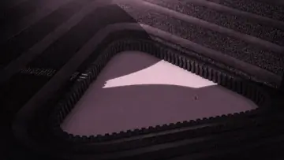
</a>
 
(Dune)HarkonenArena16_9
</td>

<td align="center" width="33.33%">
<a href="(Dune)HarkonenArmy.png">
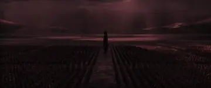
</a>
 
(Dune)HarkonenArmy
</td>

<td align="center" width="33.33%">

 
(Dune)PaulAtreides
</td>

</tr>
<tr>

<td align="center" width="33.33%">
<a href="(GOT)DrogonAndJon.png">
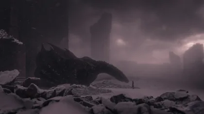
</a>
 
(GOT)DrogonAndJon
</td>

<td align="center" width="33.33%">
<a href="(GOT)DrogonKingslanding.png">
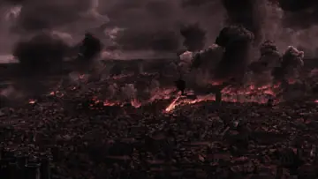
</a>
 
(GOT)DrogonKingslanding
</td>

<td align="center" width="33.33%">

 
(GOT)Khalessi
</td>

</tr>
<tr>

<td align="center" width="33.33%">
<a href="(GOT)StarkExecutingDeserter.png">
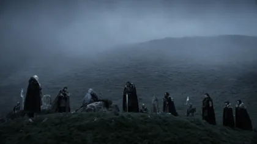
</a>
 
(GOT)StarkExecutingDeserter
</td>

<td align="center" width="33.33%">
<a href="(GOT)bridgeGOT.png">
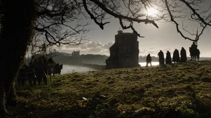
</a>
 
(GOT)bridgeGOT
</td>

<td align="center" width="33.33%">
<a href="(HOTD)Caraxes.png">
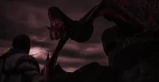
</a>
 
(HOTD)Caraxes
</td>

</tr>
<tr>

<td align="center" width="33.33%">

 
(HOTD)Gulet
</td>

<td align="center" width="33.33%">

 
(HOTD)SyraxClouds
</td>

<td align="center" width="33.33%">
<a href="(HOTD)TargaryanShip.png">
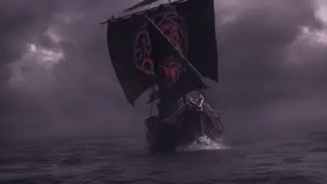
</a>
 
(HOTD)TargaryanShip
</td>

</tr>
<tr>

<td align="center" width="33.33%">

 
(HOTD)Vermithor
</td>

<td align="center" width="33.33%">
<a href="(HOTD)VhagarMoon.png">
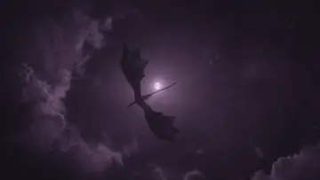
</a>
 
(HOTD)VhagarMoon
</td>

<td align="center" width="33.33%">
<a href="(Vikings)GreenishMoon.jpg">
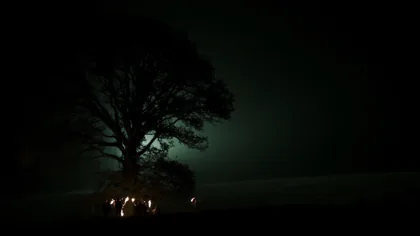
</a>
 
(Vikings)GreenishMoon
</td>

</tr>
<tr>

<td align="center" width="33.33%">

 
Dune1
</td>

<td align="center" width="33.33%">

 
Inception
</td>

<td align="center" width="33.33%">

 
JaceDeath
</td>

</tr>
<tr>

<td align="center" width="33.33%">
<a href="Planet.png">
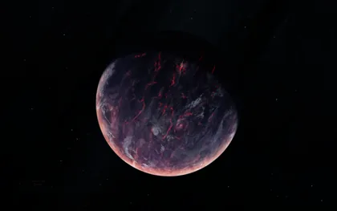
</a>
 
Planet
</td>

<td align="center" width="33.33%">

 
a_mountain_range_with_snow_on_top
</td>

<td align="center" width="33.33%">
<a href="a_plane_on_the_ground.jpg">
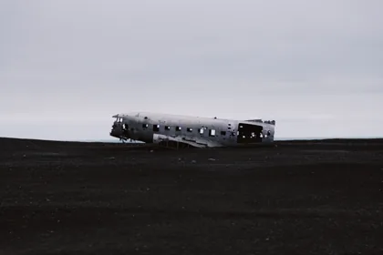
</a>
 
a_plane_on_the_ground
</td>

</tr>
<tr>

<td align="center" width="33.33%">

 
a_planet_in_space_with_clouds
</td>

<td align="center" width="33.33%">

 
a_road_with_lights_on_the_side_of_a_body_of_water
</td>

<td align="center" width="33.33%">

 
a_spiral_staircase_with_a_square_hole_in_the_middle
</td>

</tr>
<tr>

<td align="center" width="33.33%">

 
bluehour
</td>

<td align="center" width="33.33%">

 
flowers-9
</td>

<td></td>
</tr>
</table>